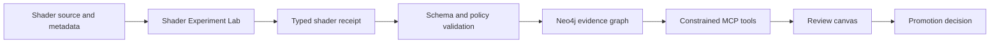

# Shader Validation and Neo4j MCP Evidence Graph

**Version:** 0.2.0  
**Status:** Implementation plan  
**Authority:** `MelodicBloom/shader-gallery`  
**Current baseline:** `main@e28557b`

## Decision

Implement the shader validation pipeline and Neo4j MCP ingestion graph as **two bounded pipelines joined by typed receipts**.

The Shader Experiment Lab owns executable truth about shader source, renderer behavior, causal fixtures, temporal replay, performance, mobile degradation, and the G0–G9 release sequence. The Evidence Kernel owns artifact identity, provenance, evidence classification, relation traversal, policy validation, review queues, and bounded context assembly. The graph may index a shader receipt, but it cannot manufacture one. A shader process may emit a receipt, but it cannot silently promote itself to canonical status.



## Product boundaries

| Product | Owns | Does not own |
|---|---|---|
| Shader Experiment Lab | GLSL/WebGL2 source, fixtures, compile/link/render/capture/replay/performance evidence, G0–G9 routing | General graph authority or arbitrary agent execution |
| Evidence Kernel | Stable IDs, hashes, provenance, evidence states, receipts, relations, promotion policy | Rendering, shader compilation, or physical truth |
| Neo4j MCP adapter | Persistence, bounded queries, validated envelope writes, audit events | Raw source authority, arbitrary agent Cypher, automatic promotion |
| Review Canvas | Lineage inspection, artifact comparison, merge and supersession review | Silent data mutation or evidence creation |
| Agent Orchestrator | Bounded catalog and verifier agents | Gate bypass, receipt authorship, repository mutation |

## Shared shader receipt

A shader receipt is a specialized graph `Receipt`. Every execution receipt must carry:

```yaml
id: receipt:shader:<experiment>:<fixture>:<outputHash>
kind: receipt
version: 0.2.0
status: blocked | proposed | evidence-complete-pending-review | canonical
evidenceClass: EMPIRICAL | PHYSICAL_MODEL | DERIVED_MATH | HYPOTHESIS
provenance:
  contentHash: sha256:<64 lowercase hex>
  observedAt: RFC3339
  actor: shader-validator/<version>
  sourceFiles: [<artifact IDs or repository paths>]
authority:
  repository: MelodicBloom/shader-gallery
  ref: <branch-or-tag>
  sha: <commit>
shader:
  shaderId: <stable ID>
  sourceHash: sha256:<hash>
  runtimeHash: sha256:<hash>
  metadataHash: sha256:<hash>
apparatus:
  renderer: WebGL2
  geometry: <fixture geometry>
  emitter: <emitter state>
  receiver: <receiver state>
  observer: <observer state>
  material: <material state>
  presentation: <tone, exposure, output state>
temporal:
  clockOrigin: <origin>
  units: seconds
  direction: forward
  wrap: <policy>
  referenceTime: <number>
  frameIndex: <number>
  sampling: <policy>
metrics: <namespaced measured values>
outputs:
  files: [<artifact IDs>]
  outputHash: sha256:<hash>
unknowns: [<explicit gaps>]
```

A metadata declaration such as `u_time` is an artifact observation, not a temporal receipt. A synthetic gatekit test is a gatekit receipt, not a shader render receipt.

## G0–G9 graph mapping

| Gate | Shader-owned evidence | Graph representation | Promotion effect |
|---|---|---|---|
| G0 identity | Repository, branch, base/head, working tree, source paths | `Source`, `Artifact`, `Experiment` | Blocks promotion when authority is unresolved |
| G1 metadata | Metadata schema result and validator version | `Receipt: schema` | Establishes semantic contract only |
| G2 toolchain | AJV/native validator and renderer health | `Receipt: toolchain` | Environment failure is not a shader failure |
| G3 compile/link | Exact source compile and link logs | `Receipt: compile`, `Receipt: link` | Required before a render claim |
| G4 capture | Frozen reference state, command, output hash | `Snapshot`, `Receipt: capture` | Required before replay |
| G5 controls | Positive, negative, null, and one-variable fixtures | `Experiment`, `Snapshot`, `Receipt: control` | Required before causal promotion |
| G6 temporal | Clock, sampling, replay, and reference-state evidence | `Receipt: replay` | Required before temporal promotion |
| G7 performance | Frame time, resource use, named device/runtime, fallback | `Receipt: performance`, `Receipt: mobile` | Required for performance class |
| G8 integration | Gallery/runtime adapter and consumer evidence | `Receipt: integration` | Does not transfer authority |
| G9 publication | Human decision, changelog, package hash | `Review`, `Receipt: gate` | Required for canonical status |

## Ingestion stages

1. **Secure intake:** hash, MIME, credential scan, archive member safety, and no code execution.
2. **Inventory:** one content object per hash; duplicate uploads become aliases.
3. **Safe extraction:** allowlisted readers produce observations, never automatic truth.
4. **Validation:** apply the shared record schema, shader receipt schema, and policy rules.
5. **Canonicalization:** normalize identifiers and evidence states; proposed duplicates require review.
6. **Idempotent persistence:** parameterized `MERGE`, immutable hashes, run and audit records.
7. **MCP exposure:** read-first tools with bounded traversal depth and node counts.
8. **Review:** inspect lineage, blockers, conflicts, and promotion prerequisites.

## Validation rules

| Code | Requirement | Failure action |
|---|---|---|
| `PROV-001` | A derived record names its source artifact | Dead-letter |
| `EVID-002` | Compile claims have compile/link receipts | Mark blocked |
| `EVID-003` | Physical/material claims have apparatus and measurement receipts | Mark hypothesis |
| `TEMP-001` | Temporal claims define clock, units, trajectory, and sampling | Mark incomplete |
| `REL-003` | `DERIVED_FROM` is acyclic | Reject transaction |
| `SEC-001` | Secret values never enter graph payload | Quarantine and rotate |
| `DUP-003` | Similarity alone cannot merge entities | Review queue |
| `AUDIT-001` | Every mutation links to a run and audit event | Roll back |
| `PROV-003` | Canonical status has an attributable review receipt | Reject promotion |

## MCP surface

### Read tools

- `get_shader_gate_status(experimentId)`
- `get_blocker_paths(seedId, depth, maxNodes)`
- `trace_receipt_lineage(receiptId, depth)`
- `compare_fixtures(experimentId, fixtureIds)`
- `find_temporal_claims_missing_prerequisites()`
- `find_confounded_fixtures()`
- `get_review_queue(filters)`
- `get_downstream_impact(id, depth)`

### Restricted write tools

- `ingest_validated_envelope(envelope)`
- `record_gate_receipt(receipt)`
- `record_review_decision(review)`
- `quarantine_artifact(id, reason)`
- `supersede_receipt(oldId, newId, reviewId)`

There is no agent-facing arbitrary `write_cypher`, delete, source-repository mutation, or credential-management tool.

## Workstreams

1. **Shader evidence:** toolchain health, compile/link, deterministic capture, causal fixtures, temporal replay, performance, and gate receipts.
2. **Graph ingestion:** schema validation, archive-safe intake, idempotent writer, dead letters, constraints, and MCP queries.
3. **Visual review:** source lineage, G0–G9 status, blocker paths, fixture comparison, and review receipts.
4. **Bounded orchestration:** catalog and verifier agents that can cite receipts and emit `PASS`, `FAIL`, `BLOCKED`, or `UNKNOWN`.
5. **Communication:** versioned plans and interactive views generated from the same vocabulary.

## Milestones

1. Freeze the graph record and shader receipt contracts.
2. Restore and document validator health as a first-class G2 receipt.
3. Translate shader outputs into graph envelopes without database writes.
4. Prove dry-run parity and explain every count delta.
5. Ingest a representative 12–20 record slice into a disposable Neo4j database.
6. Expose gate, blocker, lineage, and fixture queries through MCP.
7. Add review-canvas decisions for merges, supersession, and canonical promotion.
8. Permit controlled writes only after security remediation, schema review, idempotency proof, and G9 approval.

## Acceptance criteria

- Source, metadata, fixture, capture, and receipt have end-to-end lineage.
- Missing validator dependencies appear as G2 blockers, not shader failures.
- Metadata-only `u_time` observations cannot satisfy temporal promotion.
- Compile claims cannot become canonical without compile/link receipts.
- Confounded fixtures are rejected from causal promotion.
- Replaying an envelope creates no duplicate nodes or changed hashes.
- Secret-bearing files are quarantined and their values never appear in reports.
- MCP can answer “why blocked?” with bounded, cited paths.
- Agents cannot bypass validation, run arbitrary Cypher, delete records, or promote claims.

> **Governing rule:** Share records and verified interfaces; do not share hidden state or unearned authority.
